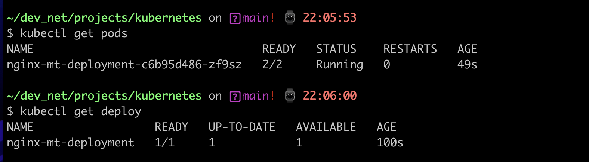

# kubernetes
## Задание 1.3
### «Запуск приложений в K8S»
1.
Данная часть задания выполнялась из kubernetes/deploy.yaml и kubernetes/service.yaml

\
2.
Данная часть задания выполнялась из kubernetes/deploy2.yaml и kubernetes/service2.yaml
\
\
\
\
\
## Задание 1.2
### «Базовые объекты K8S»
1.

 
\
2.

\
\
\
\
\
###  Задание 1.1
### «Kubernetes. Причины появления. Команда kubectl»

